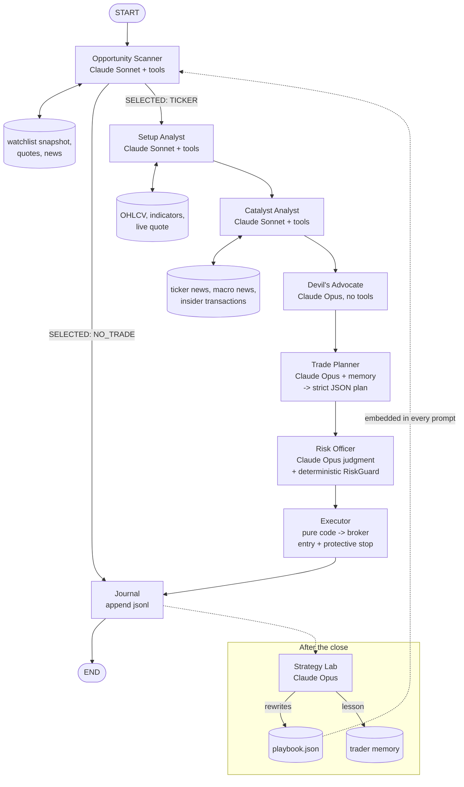

# Daily Trading Desk (Claude + Robinhood)

An autonomous daily trading graph built on the TradingAgents framework:
Claude-powered agents scan a watchlist each morning, research the single
best candidate, adversarially challenge it, and — only if a deterministic
risk engine approves — execute through a broker connector (paper by
default, Robinhood optional), then journal the session and evolve their
own playbook overnight.

## Read this first: the honest math

This desk was commissioned with $1,000 and an aspirational target of
$100,000 by the end of August. That is a 100x return in ~21 trading
sessions, i.e. **~24.5% compounded per day, every day**. For reference,
the best hedge funds in history compound ~40% *per year*.

No prompt, model, or strategy makes 24%/day a realistic expectation.
A system told to hit that number at all costs will rationally take
lottery-ticket risks and destroy the account. So the design makes a
different bet:

- The **target** is encoded in the agents' mission as aspirational
  context, but the **mandate** is *maximum sustainable geometric
  growth* — many small positive-expectancy trades, compounding.
- A deterministic **RiskGuard** (plain Python, not an LLM) has final
  authority over sizing and can halt trading entirely. No agent can
  talk it into oversizing.
- **Paper trading is the default.** Live mode is double-gated.

Expect the realistic outcome distribution of any daily strategy on
$1,000: most months land between roughly -20% and +40%. This software
is a research framework, not financial advice, and can lose all money
allocated to it.

## Architecture



### Node responsibilities

| Node | Model | Tools | Job |
|---|---|---|---|
| Opportunity Scanner | quick (Sonnet) | watchlist snapshot, quote, news, macro news | Rank the playbook watchlist; pick ONE ticker or `NO_TRADE` |
| Setup Analyst | quick (Sonnet) | OHLCV, indicators, quote | Classify the setup (breakout / continuation / gap-and-go / reversal), set exact entry/stop/target in ATR terms, ≥2R required |
| Catalyst Analyst | quick (Sonnet) | news, macro news, insider txns | Judge catalyst freshness/magnitude/durability; build the 3-session event-risk calendar |
| Devil's Advocate | deep (Opus) | none | Attack the trade: base rates, crowding, thesis fragility, level quality. Ends `VERDICT: KILL / PROCEED` |
| Trade Planner | deep (Opus) | trader memory | Synthesize everything into one strict-JSON plan; must rebut a KILL explicitly or fold |
| Risk Officer | deep (Opus) + code | RiskGuard | LLM judgment veto (coherence, correlation, event exposure) **plus** deterministic circuit breakers and sizing |
| Executor | none (pure code) | broker | Place entry, attach protective stop, report faithfully |
| Journal | none (pure code) | jsonl | One structured record per session |
| Strategy Lab | deep (Opus) | playbook + journal | Nightly: update watchlist, setup win/loss stats, distilled lessons; tune scan thresholds within hard bounds |

### The two-layer risk model

The LLM Risk Officer can only ever make the system *more* conservative.
The final sizing and every hard limit live in
`tradingagents/brokers/risk_guard.py`:

- max 2% of equity at risk per trade (entry→stop distance × size)
- max 50% of equity in a single position, max 2 open positions
- every plan needs a stop, a target, and ≥ 2:1 reward:risk
- daily loss halt at −5%: no new entries for the rest of the day
- kill switch at −20% from the high-water mark: strategy stops until a
  human calls `RiskGuard.reset_kill_switch()`
- cash-account settled-funds check (T+1), PDT tracking for margin

### Self-improvement loop ("develops its own tools")

The desk owns two evolving artifacts:

1. **`playbook.json`** — watchlist, per-setup win/loss ledger, distilled
   lessons, and scan thresholds. Every agent prompt embeds it, so a
   lesson learned Monday changes behavior Tuesday. The Strategy Lab may
   tighten/loosen thresholds only within hard-coded bounds and may never
   touch RiskGuard limits.
2. **Trader memory** — the planner retrieves reflections from similar
   past situations before writing each plan (same memory mechanism as
   the core TradingAgents graph).

## Setup

```bash
pip install .                # repo + langchain-anthropic, yfinance, etc.
export ANTHROPIC_API_KEY=... # Claude powers every agent
```

### Paper trading (default)

```bash
python run_daily.py --date 2026-08-03            # morning session
python run_daily.py --date 2026-08-03 --reflect  # evening playbook update
```

The paper broker persists a simulated $1,000 cash account (with T+1
settlement and slippage) to `results/daily_trading/paper_account.json`,
so consecutive runs form one continuous month. **Run at least a week or
two in paper mode before even considering live mode.**

### Live Robinhood trading (optional, double-gated)

> ⚠️ Robinhood has **no official public trading API**. The connector
> uses the community `robin_stocks` library, which drives the same
> endpoints as the app. Robinhood may throttle it, break it without
> notice, or restrict accounts using it. That risk is yours.

```bash
pip install robin_stocks pyotp
export RH_USERNAME=you@example.com
export RH_PASSWORD=...
export RH_MFA_SECRET=...                          # TOTP seed from RH 2FA setup
export TRADINGAGENTS_LIVE_TRADING=I_UNDERSTAND_THE_RISKS
python run_daily.py --mode live
```

Both gates are required: `--mode live` (or config) **and** the
acknowledgment env var. A misconfigured cron job cannot accidentally
trade real money.

### Scheduling (cron, times ET)

```cron
45 9  * * 1-5  cd /path/to/TradingAgents && python run_daily.py
30 16 * * 1-5  cd /path/to/TradingAgents && python run_daily.py --reflect
```

The 9:45 start is deliberate — the playbook forbids entries in the first
15 minutes while the opening range forms.

## Account-structure notes ($1,000 on Robinhood)

- **Cash account (recommended, and what the sizing assumes):** no
  pattern-day-trader rule, but sale proceeds settle T+1, so capital
  rotates every other day. The RiskGuard checks settled funds before
  every entry.
- **Margin account:** PDT limits a sub-$25k account to 3 day trades per
  5 rolling sessions. The RiskGuard tracks and enforces this if you
  switch `account_type`.
- Fractional shares are used throughout, so high-priced names stay
  tradeable.

## Files

```
tradingagents/
  brokers/
    base_broker.py        # Account/Position/Order + broker interface
    paper_broker.py       # file-backed simulator (T+1, slippage, stops)
    robinhood_broker.py   # robin_stocks connector, double-gated
    risk_guard.py         # deterministic circuit breakers + sizing
  agents/daily/
    mission.py            # shared mission preamble (the honest mandate)
    opportunity_scanner.py, setup_analyst.py, catalyst_analyst.py,
    devils_advocate.py, trade_planner.py, risk_officer.py,
    execution_agent.py, strategy_lab.py, daily_tools.py, daily_states.py
  graph/daily_trading_graph.py   # LangGraph wiring (DailyTradingGraph)
  daily_config.py                # Claude models + risk params
run_daily.py                     # CLI entry point
tests/test_risk_guard.py, tests/test_paper_broker.py
```

## Disclaimer

This framework is for research purposes. Nothing here is financial,
investment, or trading advice. Past performance of any strategy — real,
simulated, or imagined — does not indicate future results. Trading with
real money can result in the loss of all capital. The $100,000 target is
an aspiration supplied by the account owner, not a forecast, promise, or
representation of expected performance.
